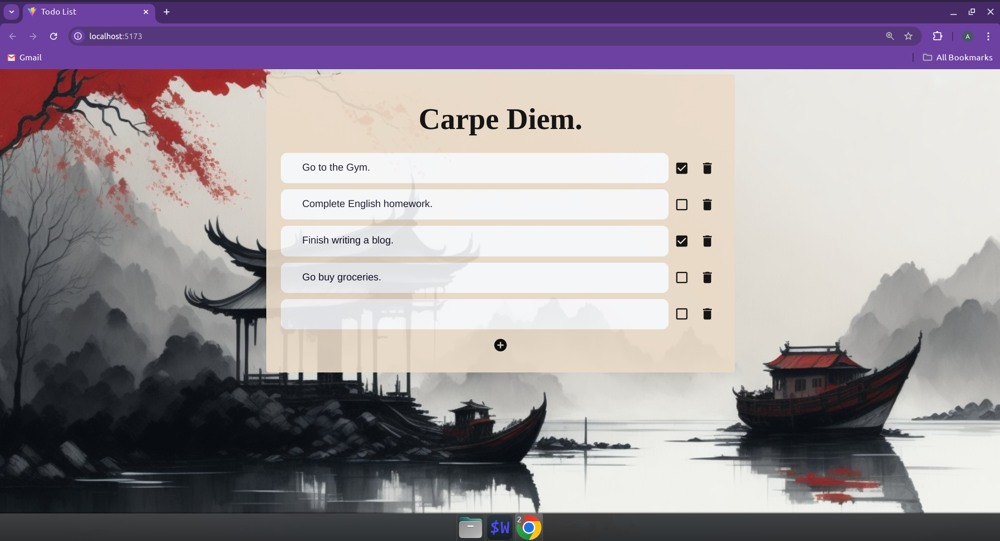

Todo List App

This is a full-stack Todo List application built with React for the frontend and Node.js for the backend. The frontend and backend are in the same repository, with the backend code located in the `server` directory.



## Features

- Add, update, and delete tasks
- Mark tasks as completed
- Responsive design
- RESTful API for managing tasks

## Getting Started

### Prerequisites

- [Node.js](https://nodejs.org/)
- [npm](https://www.npmjs.com/)
- [Git](https://git-scm.com/)

### Installation

1. **Clone the repository**

    ```bash
    git clone https://github.com/AkhileshBhasale/TodoApp
    cd TodoApp
    ```

2. **Install frontend dependencies**

    ```bash
    npm install
    ```

3. **Install backend dependencies**

    ```bash
    cd ../server
    npm install
    ```

### Running the Application

1. **Start the backend server**

    ```bash
    cd server
    node todoServer.js
    ```

    The server will run on [http://localhost:3000](http://localhost:3000).

2. **Start the frontend**

    ```bash
    cd ..
    npm run dev
    ```

    The frontend will run on [http://localhost:5173/](http://localhost:5173/) by default.

### API Endpoints

- **GET /todos**: Get all tasks
- **GET /todos/:id**: Get all tasks
- **POST /todos**: Create a new task
- **PUT /todos/:id**: Update a task
- **DELETE /api/todos/:id**: Delete a task


